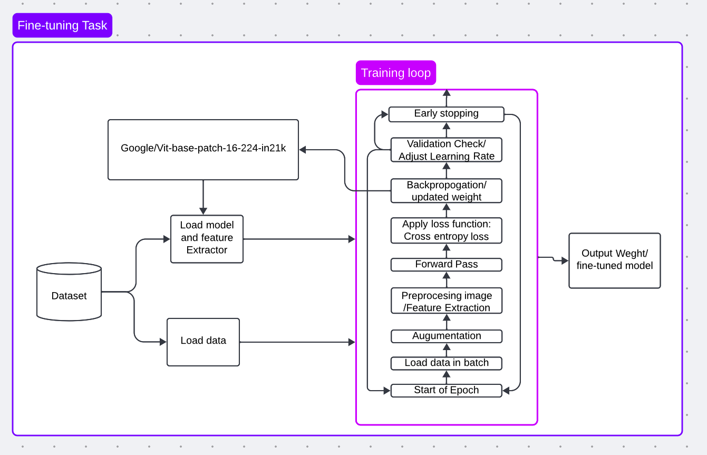
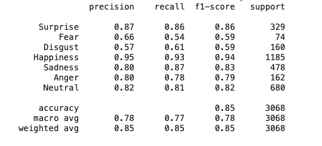
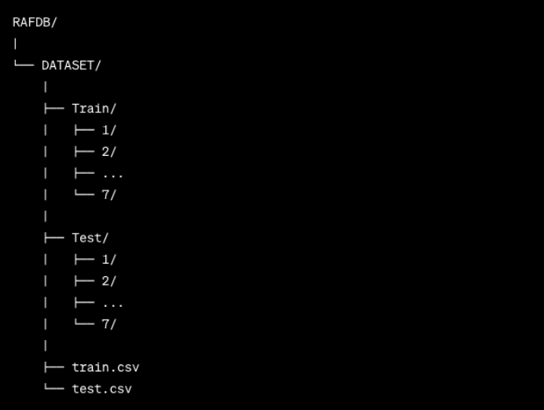

# GViT21k
### Note
This is the project assignment for my deep learning class at San Jose State Assignment, Fall 2023.

# Objective
The primary objective of this project is to leverage the advanced capabilities of pre-trained models in facial expression recognition. By utilizing models from Hugging Face, a leading repository for state-of-the-art machine learning models, and Vision Transformer (ViT), this project aims to develop a robust system capable of accurately identifying and classifying a range of human facial expressions.

The focus is on fine-tuning these pre-existing, powerful models to adapt to the specific nuances of facial expression data. This approach is expected to enhance the model's performance in terms of accuracy, efficiency, and reliability in real-world applications.

# POC

Below is my Proof of concept design for fine tuning task.

# Result

The model achieved 85% accuracy.

# Data Collection

The Emotion_Labels dictionary is a data structure that associates numerical labels with specific human emotional states. This mapping allows for a more structured and standardized representation of emotions in various applications, such as psychology, human-computer interaction, and machine learning. Each numerical key in the dictionary corresponds to a particular emotion, and the associated value provides the name or label for that emotion. Here's a breakdown of the emotions represented in the Emotion_Labels dictionary.

    emotion_labels = {
        0: "Surprise",
        1: "Fear",
        2: "Disgust",
        3: "Happiness",
        4: "Sadness",
        5: "Anger",
        6: "Neutral"
    }

There are multiple way of getting the data either form Kaggle or original author. You may need to ask author for permission before using the dataset.
1. https://www.kaggle.com/datasets/jonathanoheix/face-expression-recognition-dataset
2. http://www.whdeng.cn/raf/model1.html

The dataset must be organized as below or you will have to modify utils.py to match your project folder.

# Model
The Vision Transformer (ViT) model has undergone pretraining on the extensive ImageNet-21k dataset, encompassing a remarkable 14 million images categorized into 21,843 unique classes. This model was originally introduced in the research paper "An Image is Worth 16x16 Words: Transformers for Image Recognition at Scale" authored by Dosovitskiy et al., and it initially became available within their repository. Notably, the conversion of the model's weights to PyTorch was accomplished by Ross Wightman, who had previously taken on the task of transitioning them from JAX to PyTorch (Huggingface, 2023) It is imperative to acknowledge his significant contributions in this transformation process.

The Vision Transformer (ViT) stands as a transformer model pretrained on a substantial image dataset, ImageNet-21k, at a resolution of 224x224 pixels. In its approach, ViT views images as sequences composed of fixed-size patches, each measuring 16x16 pixels. It incorporates a distinct [CLS] token tailored for classification tasks. While ViT does not include fine-tuned heads, it provides a pretrained pooler designed for downstream applications like image classification (Huggingface, 2023). Through pretraining, ViT acquires the ability to learn representations of images, which can be applied to diverse tasks by simply adding a linear layer atop the [CLS] token, representing the entire image (Huggingface, 2023).

Read More at: https://huggingface.co/google/vit-base-patch16-224

# Training
Before training, please ensure that you have the dataset arrange as mentioned above. I trained this model on my school HPC and therefore I did not have access to the internet to download the model while training. I downloaded the model directly for offline training.

You can download it from my drive and please create another directory on the root directory as google/ and put the download model in that 

https://drive.google.com/drive/folders/1s_c1jSlSuqnnxVmtPME6djZwixHucR5I?usp=share_link

To train the model with the above details

    python train.py

# Test
Before you can test the model, please ensure you have my already finetuning weight. Please download it from my google dive: https://drive.google.com/drive/folders/1jHF3zibpKvw-pSN7hjgZFFpFstLdMG44?usp=share_link

To run the test simply do
    
    python test_model.py

# Reference

I have used the following source for this project. The rest of the code I utilized ChatGPT to assist me in making this project possible.

    dataset
        kaggle: https://www.kaggle.com/datasets/jonathanoheix/face-expression-recognition-dataset
        RAF-DB: "http://www.whdeng.cn/raf/model1.html"

    model: https://huggingface.co/google/vit-base-patch16-224
    liveDemo: https://colab.research.google.com/drive/1QnC7lV7oVFk5OZCm75fqbLAfD9qBy9bw#scrollTo=ghUlAJzKSjFT

# Cite my work
If you plan to cite my work please ensure you have this following informaiton:

    Student = {
        Insitution: "San Jose State University",
        Department: "Computer Engineering",
        Major: "MS. Computer Software Engineering",
        Semester: "Fall 2023",
        Course: "Deep Learning 258",
        Name: "Bunpheng Chhay"
    }